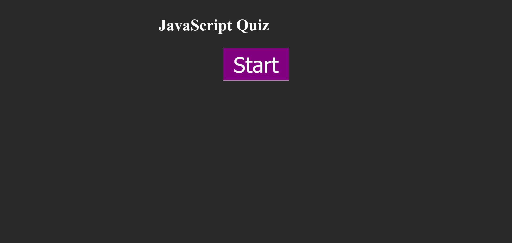

# Module 4 Challenge

## Table of Contents

- [Overview](#overview)
  - [The challenge](#the-challenge)
  - [User Story](#user-story)
  - [Acceptance Criteria](#acceptance-criteria)
  - [Screenshot](#screenshot)
  - [Links](#links)
- [My process](#my-process)
  - [Built with](#built-with)
  - [What I learned](#what-i-learned)
  - [Continued development](#continued-development)
  - [Useful resources](#useful-resources)
- [Author](#author)
- [Acknowledgments](#acknowledgments)
  ​

## Overview

This weeks challenge was create from scratch a JavaScript quiz
​

### The challenge

​Create a JavaScript quiz from scratch that would allow you to store your high-score alongside your initials

### User Story

```markdown
AS A coding boot camp student
I WANT to take a timed quiz on JavaScript fundamentals that stores high scores
SO THAT I can gauge my progress compared to my peers
```

### Acceptance Criteria

```markdown
GIVEN I am taking a code quiz
WHEN I click the start button
THEN a timer starts and I am presented with a question
WHEN I answer a question
THEN I am presented with another question
WHEN I answer a question incorrectly
THEN time is subtracted from the clock
WHEN all questions are answered or the timer reaches 0
THEN the game is over
WHEN the game is over
THEN I can save my initials and my score
```

​

### Screenshot



### Links

- Solution URL: [Solution](https://github.com/lafflin/JavaScript-Quiz-04)
- Live Site URL: [Site](https://lafflin.github.io/JavaScript-Quiz-04/)
  ​

## My process

1. The first thing I did was go through the README and write out psuedocode to get an idea of how to the project was going to work. I then went to class, got some questions I had after making the psuedocode answered during office hours, and started the next day.
2. I did a bit of work on it the following day, leading into a tutoring session in which my tutor was hugely helpful, as my tutor assisted me in creating a skeleton for how my JavaScript would work.
3. I followed this by attempting to debug some of the JavaScript issues I was running into, but was unsuccessful. After this I worked on the styling and got it to a point where I liked it and began the README.
4. After this followed a few weeks of consistent testing, as I was running into a lot of issues with things such as the quiz incrementing past the questions into the after quiz stuff properly, the local storage setting correctly, and displaying the local storage information properly.

### Built with

- HTML
- CSS
- Bootstrap
- JavaScript
- jQuery

### What I learned

- A lot about how javascript works, it also helps that it took me a few weeks becuase the extra class instruction helped me further understand the issues I was having.

### Continued development

- Make the site look prettier. Currently the design is just okay, there are a lot of things that can be improved upon.

### Useful resources

- TA's, LA's, and my tutor.

## Author

- Linkedin - [Max McLaughlin](https://www.linkedin.com/in/max-mcla/)

## Acknowledgments

- Scott Nelson, helping me hugely with my issue with the quiz not incrementing properly
- Multiple LA's for helping me figure out other smaller issues that were causing me headaches.
